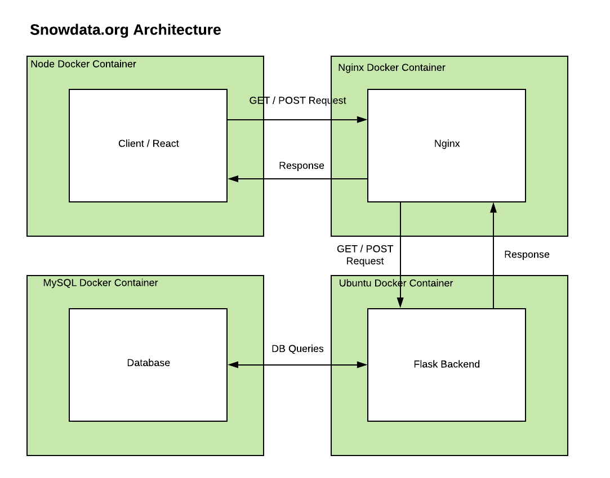
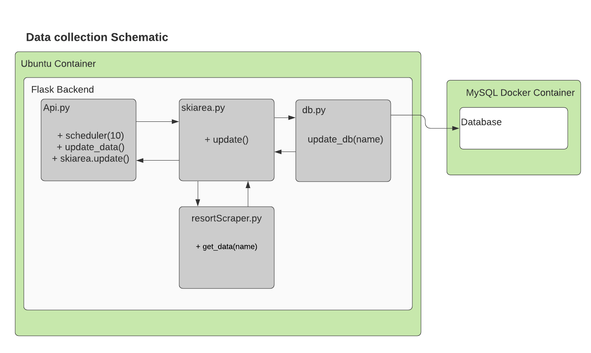

# Snowdata.org

### Prerequisites

You need to have docker and docker-compose installed on your machine. 

```
https://docs.docker.com/install/
```
```
https://docs.docker.com/compose/install/
```

## Deployment and Development 

### For development 

Build and run the docker containers in detached mode:
```
docker-compose up -d --build
```

Build the docker containers:
```
docker-compose build
```

Run the app detached without building:
```
docker-compose up -d
```

Run the app in the shell:
```
docker-compose up
```

To kill the app:

```
docker-compose down
```

## Built With

### Web Frameworks 

* [React](https://reactjs.org/) - Frontend
* [Flask](https://flask.palletsprojects.com/) - Backend

### Docker Images:

* [Node](https://hub.docker.com/_/node/) - Frontend
* [Python](https://hub.docker.com/_/python) - Backend
* [Nginx](https://hub.docker.com/_/nginx) - Reverse Proxy Server

### Dependencies

* [Frontend npm installs](frontend/package.json)
* [Backend pip installs](backend/requirements.txt)
* [Frontend Docker Image](/frontend/Dockerfile)
* [Backend Docker Image](/backend/Dockerfile)
* [Nginx Docker Image](/nginx/Dockerfile)

### End to End App Workflow

TODO




## Authors

* **Andrew Joseph** 
* **Rustin Winger** 
* **Robert Pfingsten** 

## License

This project is released under the MIT License - see the [LICENSE.md](LICENSE.md) file for details

